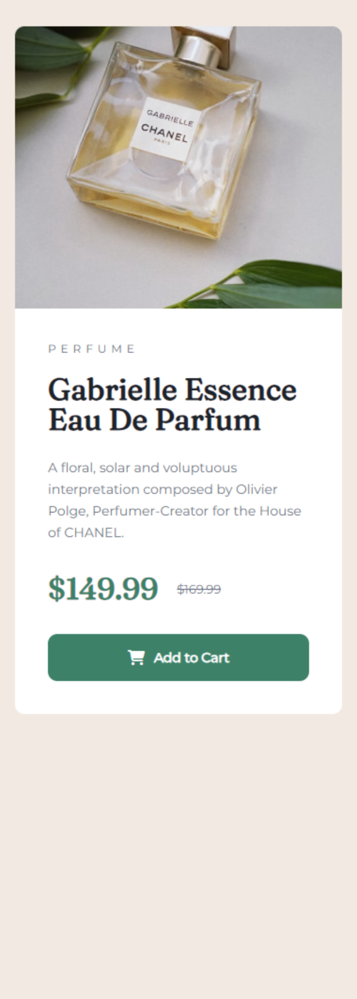

# Frontend Mentor - Product preview card component solution

This is a solution to the [Product preview card component challenge on Frontend Mentor](https://www.frontendmentor.io/challenges/product-preview-card-component-GO7UmttRfa). Frontend Mentor challenges help you improve your coding skills by building realistic projects.

## Table of contents

- [Overview](#overview)
  - [The challenge](#the-challenge)
  - [Screenshot](#screenshot)
  - [Links](#links)
- [My process](#my-process)
  - [Built with](#built-with)
  - [Continued development](#continued-development)
- [Author](#author)

## Overview

### The challenge

Users should be able to:

- View the optimal layout depending on their device's screen size
- See hover and focus states for interactive elements

### Screenshot

### Links

- Solution URL: [https://www.frontendmentor.io/solutions/product-preview-card-component-solution-using-html5-and-css3-XI1vcbzcGu](https://your-solution-url.com)
- Live Site URL: [https://amirat9.github.io/product-preview-card-component-solution/](https://your-live-site-url.com)

## My process

### Built with

- Semantic HTML5 markup
- Flexbox
- CSS Grid
- Mobile-first workflow

### Continued development

Recently I startet a my journey to become a full-stack developer and through this path learning front-end development techs is my current focus. Learning more about plain CSS and building static webpages helps my to practice my knowledge and encounter common challenges of the field.

## Author

- Frontend Mentor - [@Amirat9](https://www.frontendmentor.io/profile/yourusername)
- Github - [@Amirat9](https://github.com/Amirat9)
